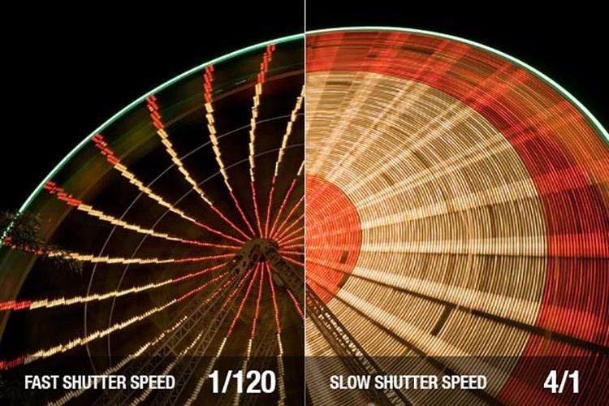
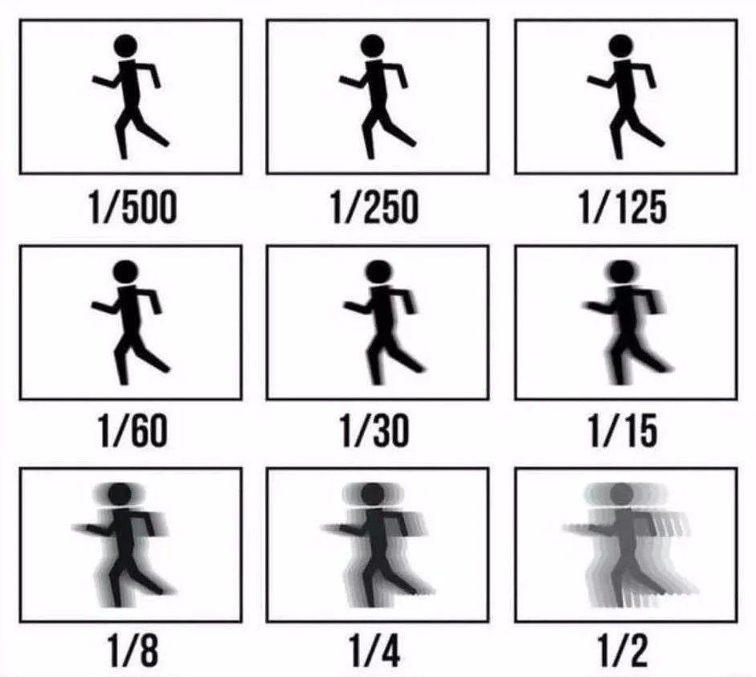
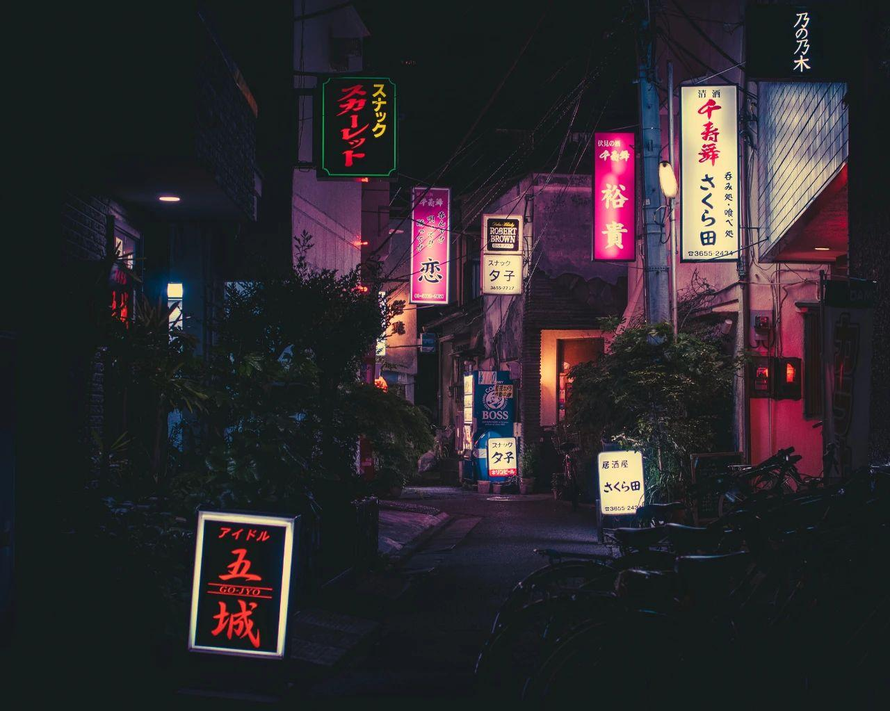

# Motion Blur/动态模糊

当你决定使用光线追踪技术的时候就已经认定视觉效果要比运行时间更重要。当我们渲染模糊反射和失焦模糊时，要对每个像素采用多重采样。包括动态模糊在内的几乎所有特效都可以通过这种方式暴力实现。
## Introduction of SpaceTime Ray Tracing/时空光线追踪介绍

快门打开时我们可以通过发射单一光线获取随机估计的光量子。这是随机(Monte Carlo蒙特卡洛)光线追踪的一个例子。
我们需要给每一束光线存储准确时间：
```C++
class ray {
  public:
    ray() {}

    ray(const point3& origin, const vec3& direction) : orig(origin), dir(direction), tm(0)
    {}

    ray(const point3& origin, const vec3& direction, double time = 0.0)
      : orig(origin), dir(direction), tm(time)
    {}

    point3 origin() const  { return orig; }
    vec3 direction() const { return dir; }
    double time() const    { return tm; }

    point3 at(double t) const {
        return orig + t*dir;
    }

  private:
    point3 orig;
    vec3 dir;
    double tm;
};
```
## Managing Time/管理时间

### 快门时间

快门速度越快，越能捕捉高速瞬间



快门速度越慢，越能持续捕捉光线，拍摄出夜景、车流等效果





关于快门的时间有两个角度需要我们考虑：
1. 从第一个快门开启到第二个快门开启的时间
2. 每一帧快门开启会保持多长时间

每一帧的快门速度一般不会是这一帧的最长时间，你可以让快门速度为每一帧1/1000秒或1/60秒

## 更新相机来模拟动态模糊

[camera.h]
```c++ 
class camera {
  ...
  private:
    ...
    ray get_ray(int i, int j) const {
        // Get a randomly-sampled camera ray for the pixel at location i,j, originating from
        // the camera defocus disk.

        auto pixel_center = pixel00_loc + (i * pixel_delta_u) + (j * pixel_delta_v);
        auto pixel_sample = pixel_center + pixel_sample_square();

        auto ray_origin = (defocus_angle <= 0) ? center : defocus_disk_sample();
        auto ray_direction = pixel_sample - ray_origin;
        auto ray_time = random_double();

        return ray(ray_origin, ray_direction, ray_time);
    }

    ...
};
```

